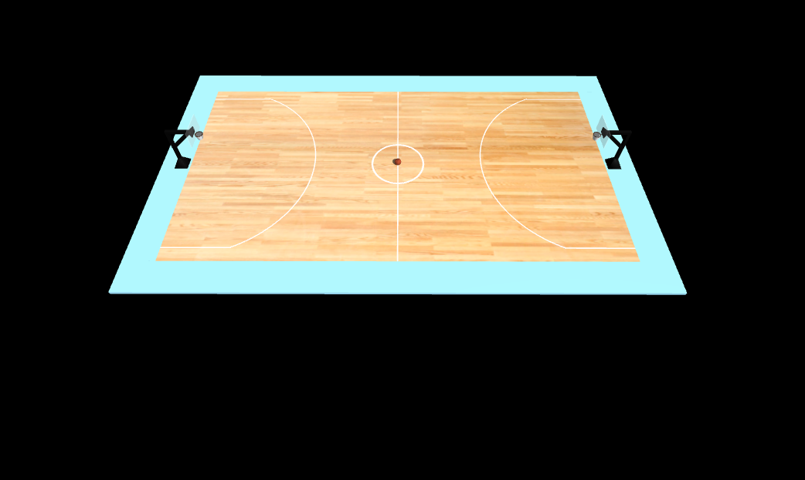
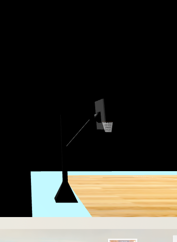
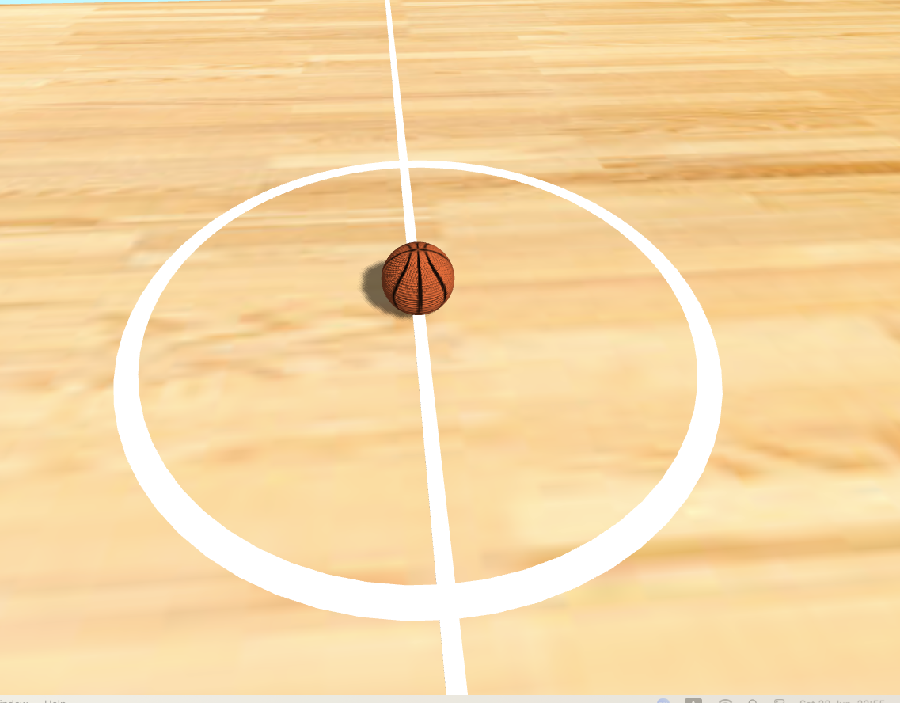
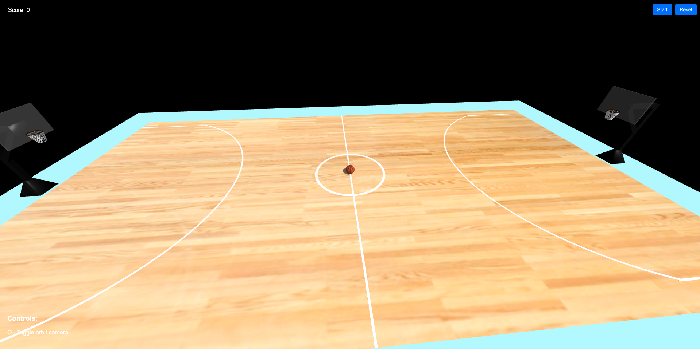

# Computer Graphics - Exercise 5 - WebGL Basketball Court

## Getting Started
1. Clone this repository to your local machine
2. Make sure you have Node.js installed
3. Start the local web server: `node index.js`
4. Open your browser and go to http://localhost:8000

## Complete Instructions
**All detailed instructions, requirements, and specifications can be found in:**
`basketball_exercise_instructions.html`

## Group Members
**MANDATORY: Add the full names of all group members here:**
- [Ariel Jankelowitz]
- [David Dusi]

## Technical Details
- Run the server with: `node index.js`
- Access at http://localhost:8000 in your web browser

# Basketball Court Project

## Screenshots

### Overall view of the basketball court with hoops

### Close-up view of basketball hoops with nets

### Basketball positioned at center court

### Camera controls functionality demonstration

